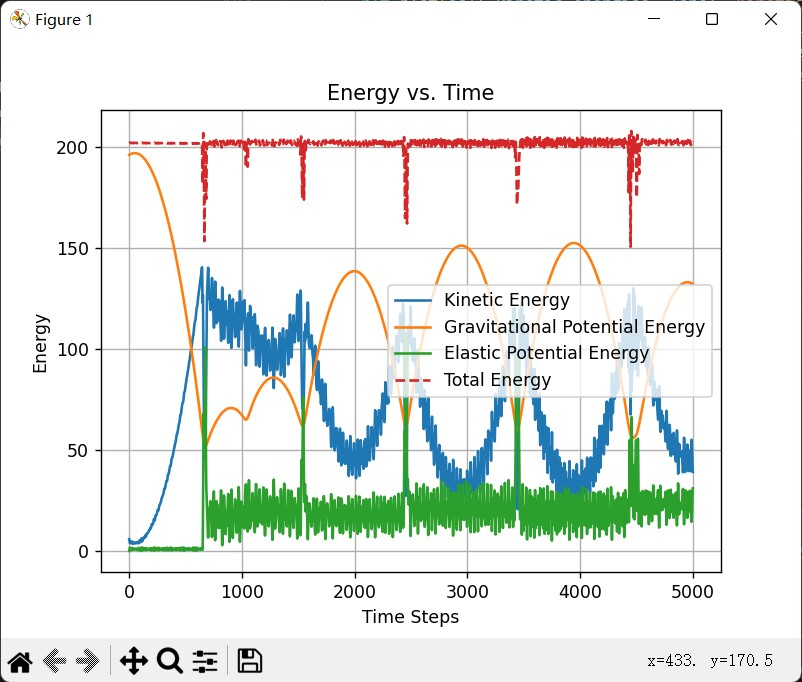
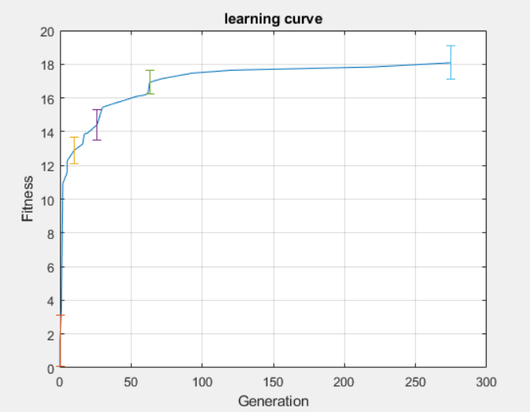
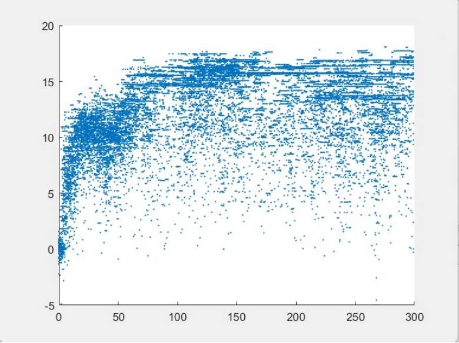
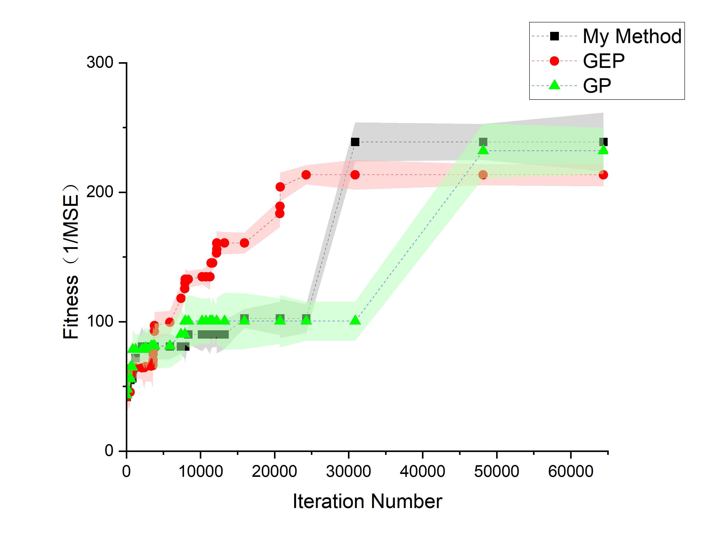
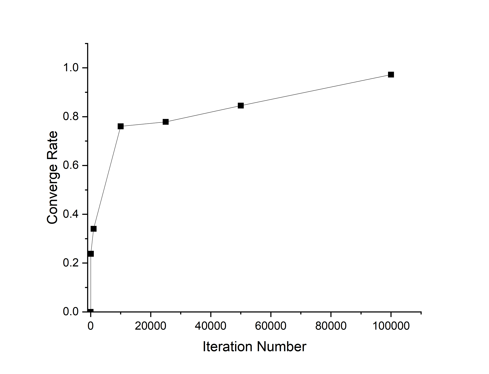
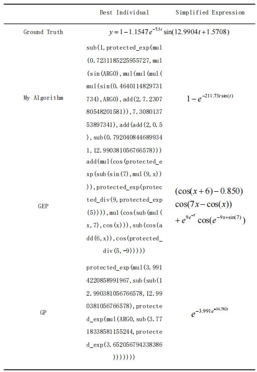

## Evolutionary Alogrithm Project

This GitHub repo contains all the content related to evolutionary algorithms that I learned under the guidance of Professor Hod Lipson, mainly including symbolic regression and evolutionary robotics.

## Evolutionary robotics
In the evolutionary robotics project, we aim to use evolutionary algorithms to design a robot made of mass and springs. I first built a simple spring-mass physics simulator to evolve our robots, and then the robot evolves by combining different structures and varying the extension cycles of the springs. The goal is to find a robot that can move in a specified direction. (Source code in ROBOEVO folder)

The following images show the results and some evaluation of the algorithm.

 
Figure 1. Verification of the simulator through energy conservation 

 
Figure 2. Best result from evolution 

 
Figure 3. comparison between two different result 

 
Figure 4. Learning Curve of algorithm 

 
Figure 5. Dot plot of individuals 

## Symbolic Regression

In the symbolic regression project, I studied the basic GP algorithm and the GEP algorithm based on the DEAP framework. I also incorporated a non-dominated sorting algorithm, NSGA-II, which utilizes the concept of Pareto optimality. Additionally, I introduced a new method for calculating formula complexity in an attempt to address the issue of formula bloat in symbolic regression problems.(Source code in SR folder)

The following table and images show the results and some evaluation of the algorithm.

 
Figure 6. Comparison between GP, GEP and my work 

 
Figure 6. Converge plot of the algorithm 

Table 1. Regression result comparison 
 
